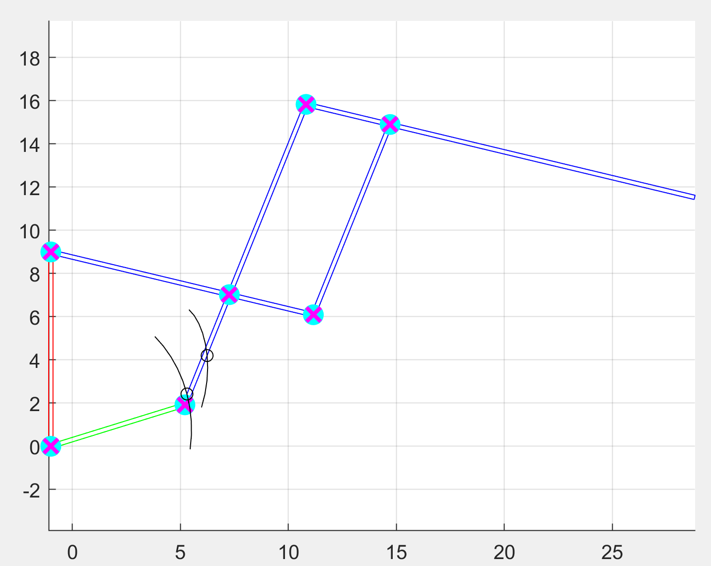
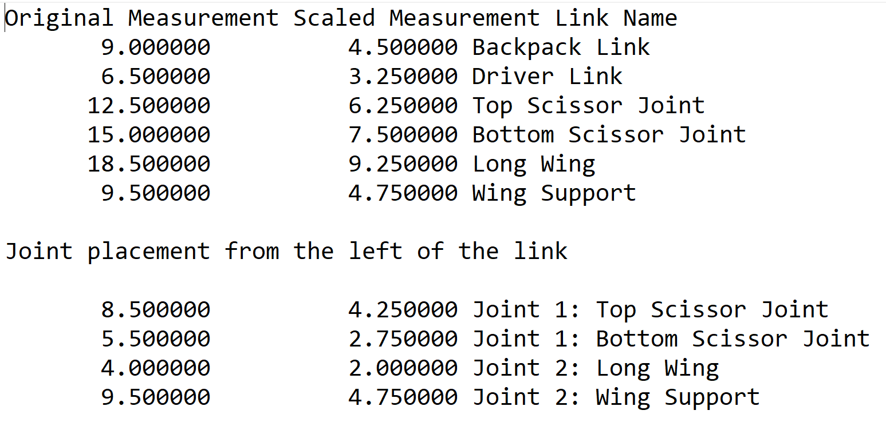
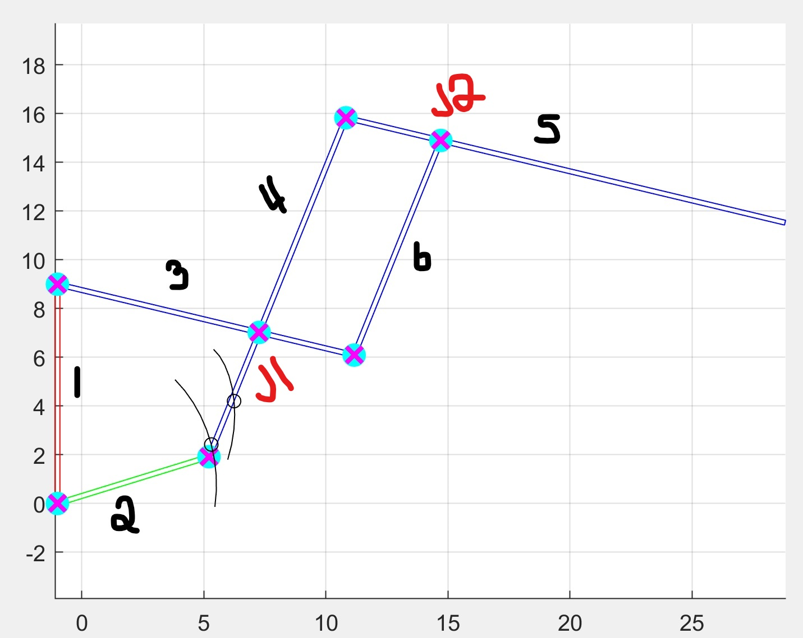

# CS581 Wing Project Overview

For CS581 (Computational Fabrication) with Professor Emily Whiting, we were given the freedom to chose whatever we want to create for our final project. Our team chose to create a set of functional wings that can be attached to a figurine. Our main goal was to create a pair of wings that can open and close. This leads to our problem statement of "What joint is best to use to emulate wings flapping?" We determined that annular joints was best for our goal. For our fabrication aspect of our project, we used Onshape to design our wings and feathers. We used the Makerbot printer to print the joints and a laser cutter to cut out the feathers. We manually had to glue together the feathers onto the joints. 

# Computational Aspect

For our computational aspect, the goal was to make our wings customizable by giving the users measurements for them to fabricate on their own. We took inspiration and built upon our course's Linkages assignment, where we had to create multiple different linkages in Matlab. We decided to follow this [wing tutorial](https://www.blackowlstudio.com/en/tutorial-crafting-articulated-wings/) from Black Owl Studio and digitize the proposed wing frame in Matlab for size customization. 

Below is the wing frame blueprint that we digitized with its original dimensions. 


# Our Code
The parameters or inputs to our function are: 
```
final(scene, scale)
```

Scene should always be 10, as there is only one scene. The scale allows the user to customize the size of the wing, whether they want to scale up or down from the original size.

The output of our function is a simulation of the wing movement from Matlab and a text file called `dimensions.txt` that contains the original measurements with the scaled measurements and the respective joints. 


<table>
<tr>
<th> Screencap of the simulation of the wing movement </th>
<th> Example of the text file containing the link and joint measurements </th>
</tr>
<tr>
<td>





</td>
<td>





</td>
</tr>
</table>

# Link Names


<table>
<tr>
<th> Image </th>
<th> Labels </th>
</tr>
<tr>
<td>




</td>
<td>


| Link Number | Link Name |
| --- | ----------- |
| 1 | Backpack Link |
| 2 | Driver Link |
| 3 | Top Scissor Joint |
| 4 | Bottom Scissor Joint |
| 5 | Long Wing |
| 6 | Wing Support |
| Joint Number | Joint |
| J1 | Top Scissor Joint & Bottom Scissor Joint |
| J2 | Long Wing & Wing Support |


</td>
</tr>
</table>


# Example runs
If the user wants to make the wing half the size of the original, they would run the function with these parameters: 
```
final(10,0.5)
```

If the user wants to make the wing double the size of the original, they would run the function with these parameters: 
```
final(10,2)
```
